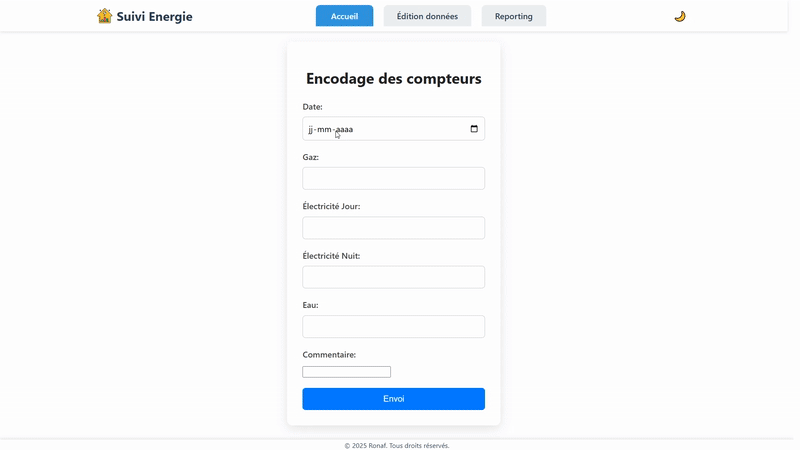

# Application de Suivi Énergétique


**Application web Flask** permettant d'importer, gérer, visualiser, analyser et exporter des données de consommation énergétique.  
Idéale pour un usage domestique souhaitant suivre ses postes de consommation (gaz, électricité, etc.).



## Fonctionnalités principales

- Saisie et mise à jour des données via un **formulaire web dynamique**.
- **Stockage simple** et portable des données dans une DB SQLite3, avec export automatique vers un fichier CSV (`energy.csv`).
- **Visualisation graphique** (via Matplotlib) des tendances de consommation avec filtres personnalisables (+ Export au format Excel (`.xlsx`)).
- **Édition manuelle** des données depuis une interface web conviviale.
- **Configuration flexible** des champs via un fichier JSON, sans toucher au code.


## Arborescence des fichiers

```
project_root/
├── app.py                   # Application Flask principale
├── config/
│   └── config.json          # Configuration des champs et paramètres
├── data/                    # DB et fichier CSV (exemple pouvant être supprimé)
├── templates/               # Pages HTML
└── static/                  # Fichiers statiques ( CSS, JS, images)
```
**Remarque :**  
Les fichiers `data/energy.*` fournis sont des **exemples de données** servant à la démonstration.  
Ils peuvent être **supprimés** sans impact avant une première utilisation réelle. 


## Configuration et Installation

### Configuration

Le fichier `config/config.json` contient la liste des champs à gérer et leurs types :

```
{
  "fields": [
    { "name": "gaz", "label": "Gaz", "required": true, "type": "number" },
    { "name": "comment", "label": "Commentaire", "required": false, "type": "text" }
  ]
}
```

Chaque champ possède plusieurs propriétés :

- **name** (string) :  
  Identifiant unique du champ. Utilisé en interne pour récupérer ou manipuler la valeur.

- **label** (string) :  
  Nom affiché à l'utilisateur pour décrire le champ.

- **required** (boolean) :  
  Indique si le champ est obligatoire (`true`) ou non (`false`) lors de l'encodage.

- **type** (string) :  
  Type de donnée attendu pour ce champ. Exemple :  
  - `"number"` pour un nombre  
  - `"text"` pour du texte

### Installation

Vous pouvez utiliser l'application de deux manières :  
1. En local avec Python  
2. Via un conteneur Docker

#### 1. Installation avec Python

Étapes :

1. Cloner le dépôt :

```bash
git clone https://github.com/Ronaf-git/energy-tracker

cd energy-tracker
```

2. Installer les dépendances :
```
py -m pip install -r requirements.txt
```
3. Lancer l'application :
```bash
cd app
py app.py
```
L'application sera accessible sur http://localhost:8080


#### 2. Installation avec Docker

1. Cloner le dépôt :
```bash
git clone https://github.com/Ronaf-git/energy-tracker
cd energy-tracker
```
2. Actualisez le fichier `docker-compose.yml` à la racine du projet, avec vos port et volumes :

```yaml
services:
  energy_app:
    image: energy-tracker-energy_app:latest
    build: .
    ports:
      - "VOTRE_PORT:8080"
    volumes:
      - VOTRE_DOSSIER_DATA:/data
      - VOTRE_DOSSIER_CONFIG:/config
    restart: always
```

3. Construire l'image Docker :
```
docker-compose build
```
4. Démarrer le conteneur :
```
docker-compose up -d
```
5. Accéder à l'application dans votre navigateur :

http://localhost:8080
ou VOTRE_IP:LE_PORT_EXPOSE
 
## Description des routes

- `/` (GET, POST)  
  Page d'accueil avec formulaire de saisie des données.  
  En POST, les données sont ajoutées ou mises à jour dans la DB.

- `/data` (GET)  
  Affiche les données filtrées, les variations calculées et un graphique.

- `/download_xlsx` (GET)  
  Permet de télécharger les données filtrées au format Excel.

- `/edit` (GET, POST)  
  Interface d'édition des données.  
  En POST, sauvegarde les modifications en conservant les champs non affichés.


## Remarques

- Les dates doivent être au format ISO `YYYY-MM-DD`.  
- Un script de migration est disponible pour transférer les données des versions 0.3 et précédentes vers la version 0.4 et plus.
