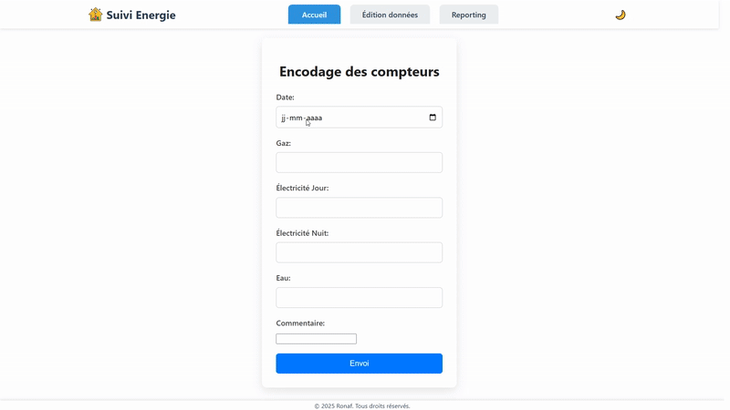

# Application de Suivi Énergétique


**Application web Flask** permettant d'importer, gérer, visualiser, analyser et exporter des données de consommation énergétique.  
Idéale pour un usage domestique souhaitant suivre ses postes de consommation (gaz, électricité, etc.).



## Fonctionnalités principales

- Saisie et mise à jour des données via un **formulaire web dynamique**.
- **Stockage simple** et portable des données dans une DB SQLite3, avec export automatique vers un fichier CSV (`energy.csv`).
- **Visualisation graphique** (via Matplotlib) des tendances de consommation avec filtres personnalisables (+ Export au format Excel (`.xlsx`)).
- **Édition manuelle** des données depuis une interface web conviviale.
- **Configuration flexible** des champs via un fichier JSON, sans toucher au code.


## Arborescence des fichiers

```
project_root/
├── app/                         # Code de l’application Flask
│   ├── app.py                   # Point d’entrée principal (routes Flask)
│   ├── static/                  # Fichiers statiques (CSS, JS, images)
│   ├── templates/               # Fichiers HTML 
│   ├── db/                      # Couche DB
│   │   ├── __init__.py
│   │   ├── connection.py        # Connexion à la DB
│   │   ├── schema.py            # Création de la base
│   │   └── crud.py              # Opérations CRUD
│   ├── utils/                   # Fonctions utilitaires
│   │   ├── __init__.py
│   │   ├── processing.py        # Traitement des données 
│   │   ├── pivot.py             # Génération de tableaux de synthèse 
│   │   └── plotting.py          # Génération de graphiques matplotlib
├── config/
│   └── config.json              # Configuration de l’application 
├── data/                        # Contient la base de données et les fichiers exportés 
│   └── energy.db
│   └── energy.csv
├── .env.example                 # Modèle de configuration des variables d’environnement
├── README.md                    # Documentation du projet
└── requirements.txt             # Dépendances Python
```
**Remarque :**  
Les fichiers `data/energy.*` fournis sont des **exemples de données** servant à la démonstration.  
Ils peuvent être **supprimés** sans impact avant une première utilisation réelle. 


## Configuration et Installation

### Étape 1 — Fichier d'environnement

Copier `.env.example` en `.env` à la racine du projet :

```bash
cp .env.example .env
```

Renseigner les trois variables :

| Variable | Description |
|----------|-------------|
| `SECRET_KEY` | Clé secrète Flask. N'importe quelle chaîne de caractères fonctionne — plus elle est longue et aléatoire, plus c'est sécurisé. |
| `APP_USER` | Login de connexion à l'application |
| `APP_PASSWORD` | Mot de passe de connexion à l'application |

### Étape 2 — Configuration des champs

Le fichier `config/config.json` contient la liste des champs à gérer et leurs types :

```json
{
  "fields": [
    { "name": "gaz", "label": "Gaz", "required": true, "type": "number" },
    { "name": "comment", "label": "Commentaire", "required": false, "type": "text" }
  ]
}
```

Chaque champ possède plusieurs propriétés :

- **name** (string) : identifiant unique du champ, utilisé en interne.
- **label** (string) : nom affiché à l'utilisateur.
- **required** (boolean) : champ obligatoire (`true`) ou non (`false`).
- **type** (string) : `"number"` pour un nombre, `"text"` pour du texte.

### Étape 3 — Lancement

Vous pouvez utiliser l'application de deux manières :  
1. En local avec Python  
2. Via un conteneur Docker

#### 1. Installation avec Python

1. Cloner le dépôt :

```bash
git clone https://github.com/Ronaf-git/energy-tracker
cd energy-tracker
```

2. Suivre les étapes 1 et 2 ci-dessus.

3. Installer les dépendances :
```bash
py -m pip install -r requirements.txt
```

4. Lancer l'application :
```bash
cd app
py app.py
```

L'application sera accessible sur http://localhost:8080

#### 2. Installation avec Docker

1. Cloner le dépôt :
```bash
git clone https://github.com/Ronaf-git/energy-tracker
cd energy-tracker
```

2. Suivre les étapes 1 et 2 ci-dessus.

3. Actualisez le fichier `docker-compose.yml` avec vos volumes si nécessaire.

4. Construire et démarrer :
```bash
docker-compose up --build -d
```

5. Accéder à l'application dans votre navigateur :

http://localhost:8080
 
## Description des routes

- `/` (GET, POST)  
  Page d'accueil avec formulaire de saisie des données.  
  En POST, les données sont ajoutées ou mises à jour dans la DB.

- `/data` (GET)  
  Affiche les données filtrées, les variations calculées et un graphique.

- `/download_xlsx` (GET)  
  Permet de télécharger les données filtrées au format Excel.

- `/edit` (GET, POST)  
  Interface d'édition des données.  
  En POST, sauvegarde les modifications en conservant les champs non affichés.


## Authentification

L'accès est protégé par un login/mot de passe géré par nginx (HTTP Basic Auth). Les identifiants se configurent dans le `.env` — voir **Étape 1** ci-dessus.

## Remarques

- Les dates doivent être au format ISO `YYYY-MM-DD`.  
- Un script de migration est disponible pour transférer les données des versions 0.3 et précédentes vers la version 0.4 et plus.
